# ShiJiWebMigrate
史迹Web版本

预览：现在没了 因为没钱买服务器了

### 首要需求

- [ ] 主页相关
    - [x] 历代数据
    - [x] 事件纪年
    - [x] 古籍查询/阅读
    - [x] 学术新闻
        - [x] api/爬虫
- [x] 事件纪年
- [x] 古籍阅读
    - [x] 阅读
- [x] 单词解析

### 次级需求

- [x] 知识图谱
- [ ] 数据量化
    - [x] 词向量
    - [x] 地理位置
    - [x] 时间
    - [ ] 查询(推迟)

### 可能实现的需求

- [ ] 主页面轮播

### 技术选型

#### 前端

为了兼容队友技术栈而使用了`JavaScript`而不是`TypeScript`

- JavaScript
- vue
- element-ui

#### 后端

本项目经历过一次重构，将原来的`kratos`微服务框架改为了使用`Gin`框架~~(咋还越用越垃了)~~

主要原因是个人后面比赛的时候发现臃肿繁琐的微服务框架拖累了个人开发效率(这种设计就跟中台方案一样大抵只适用与大型项目)，所以转而使用了轻便的`Gin`框架(这就是为什么是apiv2)

- Go
- Gin

#### 安卓

原生安卓

- Java

### 截图

#### Web端

|         主页&历史地图演变         |         时间纪年         |
| :-------------------------------: | :----------------------: |
| 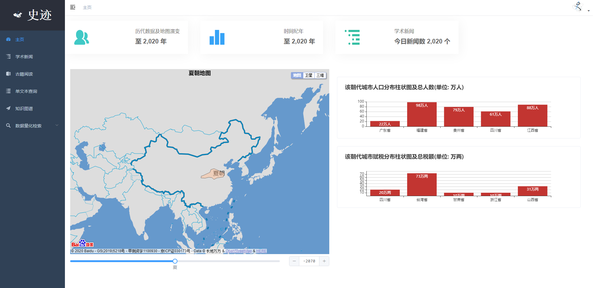 | 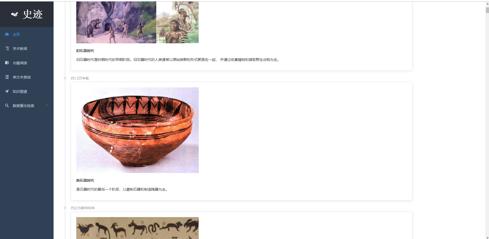 |

|         新闻         |         新闻详细         |
| :------------------: | :----------------------: |
|  |  |

|         阅读         |         阅读详细         |
| :------------------: | :----------------------: |
| 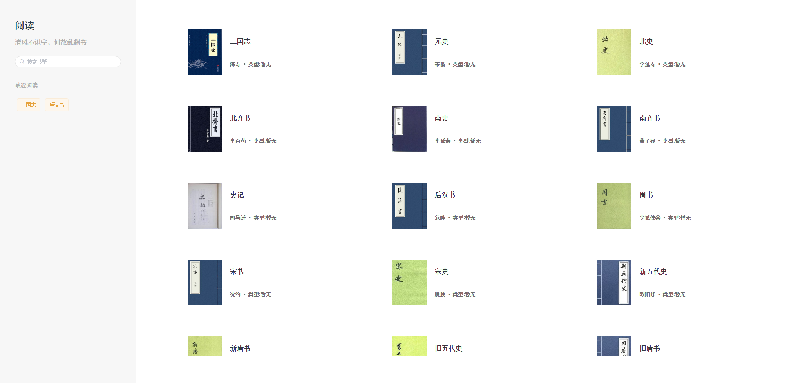 | 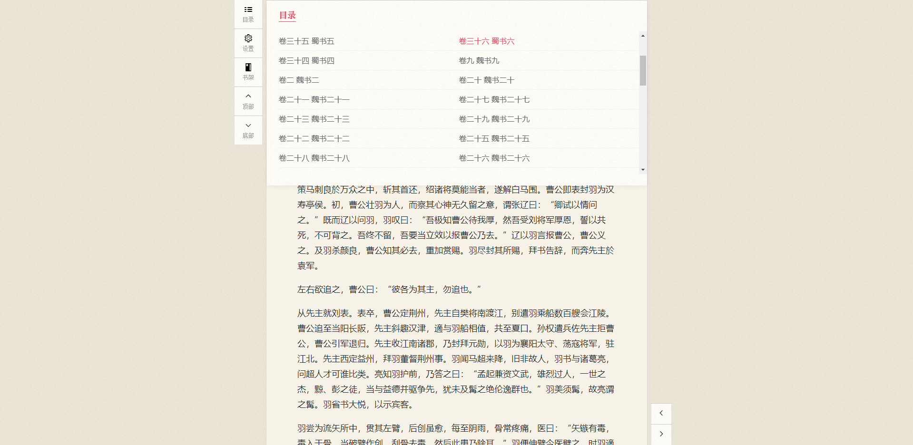 |

|         单文本查询         |        单文本查询详细        |
| :------------------------: | :--------------------------: |
| 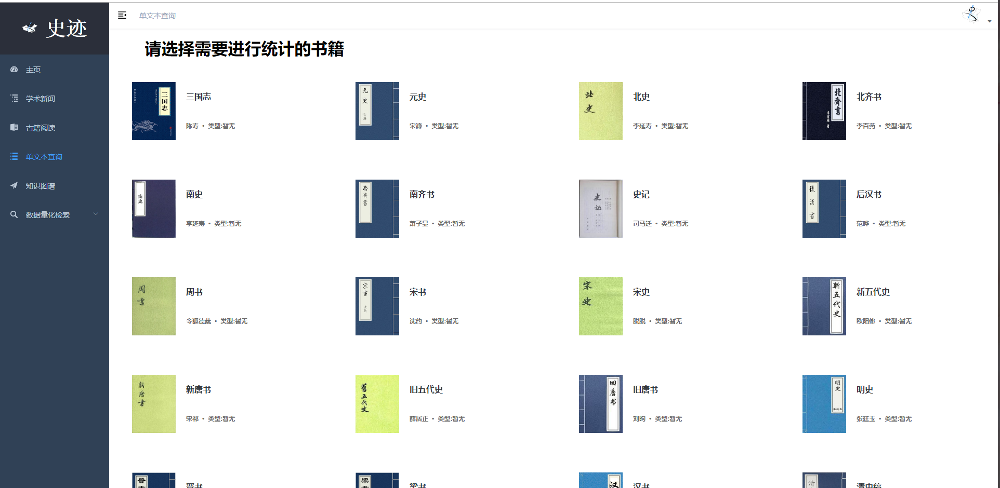 | 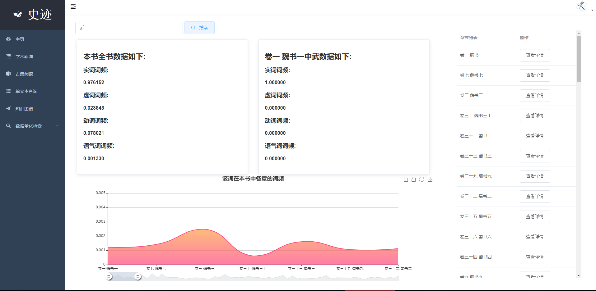 |

|     知识图谱      |   扩展知识图谱    |
| :---------------: | :---------------: |
| 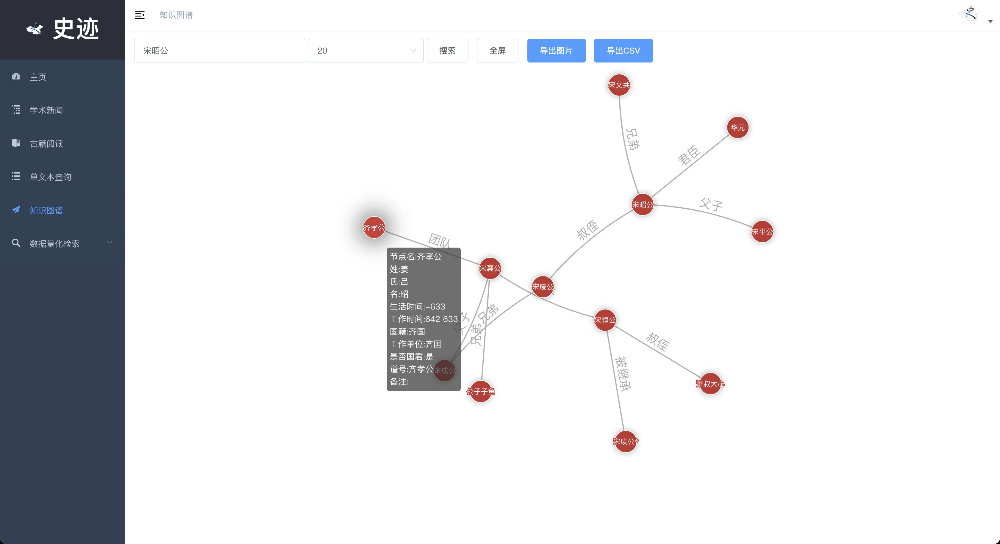 | 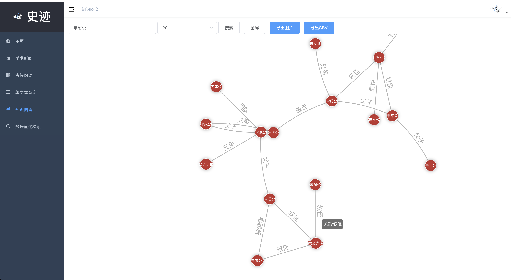 |

|   人口数据查询    |  耕地面积数据查询   |
| :---------------: | :-----------------: |
|  |  |

|        基于时间查询        |   地理位置查询    |
| :------------------------: | :---------------: |
| 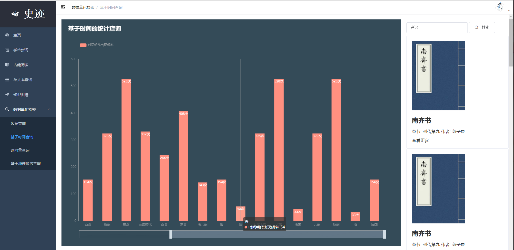 | 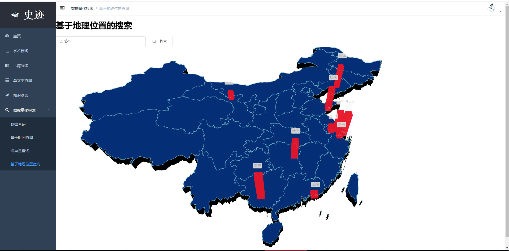 |

|        词向量        |    词向量详细     |
| :------------------: | :---------------: |
| 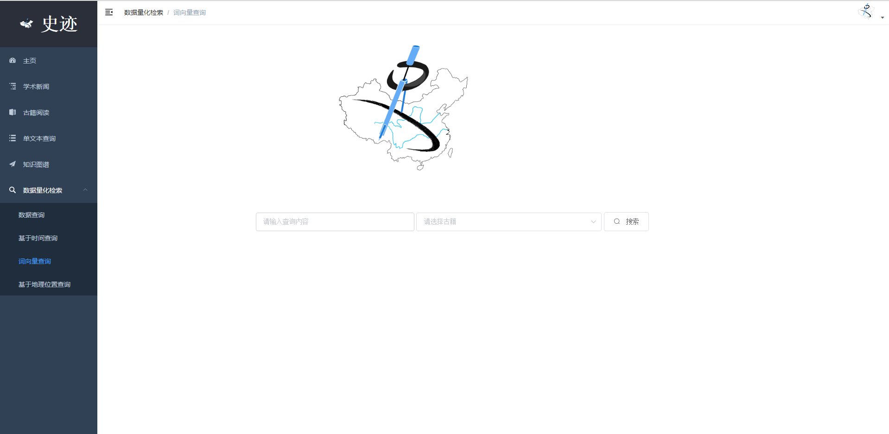 | 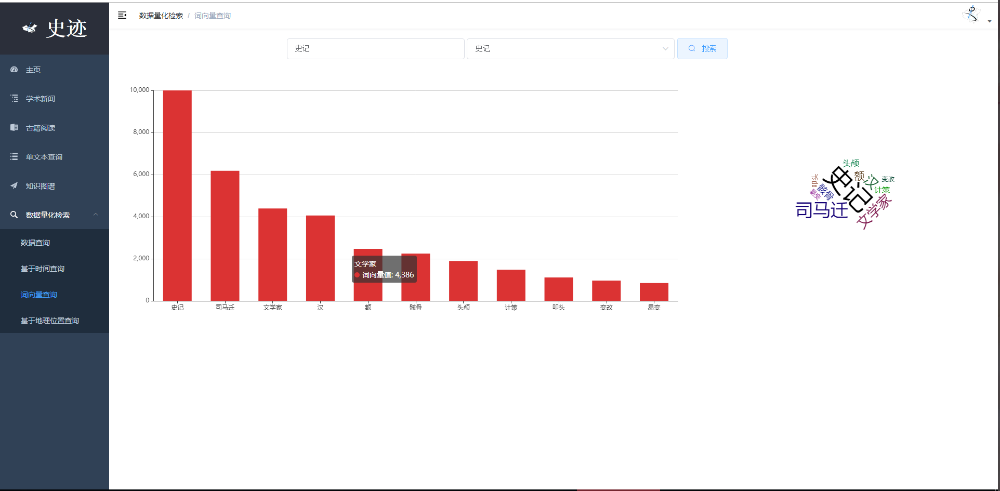 |

### 运行

请参见各文件夹内`Dockerfile`命令或者自行`docker run`

### 总结

总的来说，本项目其实还有许多没有完善的地方，达到能够使用的地步还存在很远的距离

